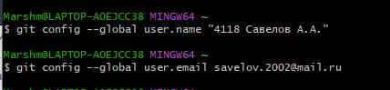

# LR6
Лабораторная работа №6

## Цель работы 

Изучение базовых возможностей системы управления версиями, опыт работы с Git Api, опыт работы с локальным и удаленным репозиторием.

## Ход работы

1. Создал аккаунт на сайте GitHub - pbsav.
2. Сделал копию в личное хранилище.

3. Установил Git.
4. После установки настроил клиент git, введя имя пользователя (Группа
Фамилия И.О.) и email.

5. Клонировал свой личный удалённый репозиторий на компьютер.

6. Добавил файл через интерфейс GitHub. Подтянуть изменения в
локальный репозиторий.

Работу продолжил локально.
7. Получил историю операций для каждой из веток.

8. Просмотрел последние изменения.

9. Выполнил слияние в ветку master, разрешив конфликт.

10. Удалил побочную ветку после успешного слияния.

11. Сделал изменения и зафиксировал их.

12. Сделал откат коммита.

13. Создал ветку для отчёта.
![(рис 13)][./screenshots/13.jpg]

## Лог команд 

   83  git clone https://github.com/pbsav/LR6.git
   84  cd LR6
   85  git fetch origin
   86  git checkout branch1
   87  git checkout patch1
   88  git checkout patch1
   89  git log
   90  git checkout master
   91  git log master
   92  git reflog
   93  git merge patch1
   94  git branch -a patch1
   95  git branch -d patch1
   96  git puch origin -d patch1
   97  git push origin -d patch1
   98  git push origin -d patch1
   99  git add ripfile.txt
  100  touch ripfile.txt
  101  git add ripfile.txt
  102  git commit -m "its cool!"
  103  git log --graph
  104  git reset --hard ~HEAD
  105  git reset --hard HEAD~
  106  git log --graph
  107  git branch myreport
  108  git checkout myreport
  109  git push https://github.com/pbsav/LR6.git

## Вывод

Я изучил базовые возможности системы управления версиями, получил опыт работы с Git Api и опыт работы с локальным и удаленным репозиторием.